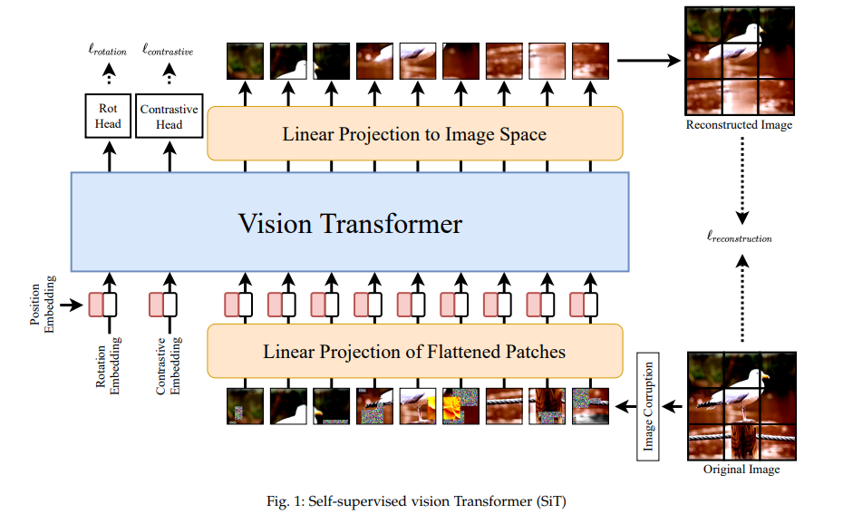

# SiT: Self-Supervised Vision Transformer
This repo contain unofficial implementation of [SiT: Self-supervised vIsion Transformer](https://arxiv.org/abs/2104.03602), for official repo check [here](https://github.com/Sara-Ahmed/SiT).


## Usage:
```python
import torch
from sit import SiT
import numpy as np

img = torch.ones([1, 3, 224, 224])

model = SiT(image_size=224, patch_size=16, rotation_node=4, contrastive_head=512)

parameters = filter(lambda p: p.requires_grad, model.parameters())
parameters = sum([np.prod(p.size()) for p in parameters]) / 1_000_000
print('Trainable Parameters: %.3fM' % parameters)

l_rotation, l_contrastive, out_img = model(img)

print("Shape of out :", out_img.shape)  # [B, in_channels, image_size, image_size]
print("Shape of l_rotation :", l_rotation.shape) # [B, rotation_node]
print("Shape of l_contrastive :", l_contrastive.shape) # [B, contrastive_head]
```

## Citation:
```
@misc{atito2021sit,
      title={SiT: Self-supervised vIsion Transformer}, 
      author={Sara Atito and Muhammad Awais and Josef Kittler},
      year={2021},
      eprint={2104.03602},
      archivePrefix={arXiv},
      primaryClass={cs.CV}
}
```

